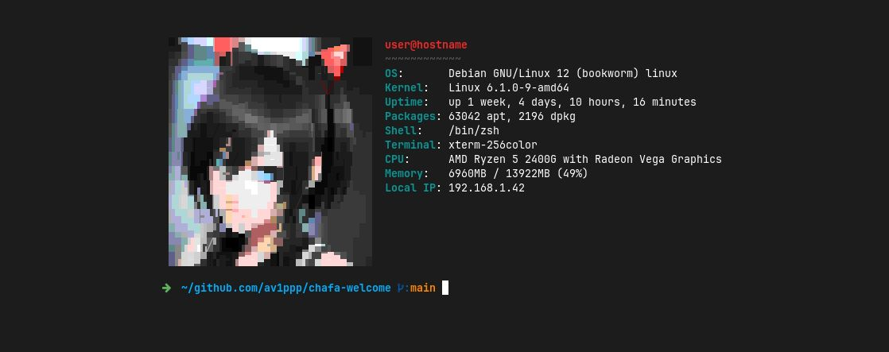

<p align="center">


<br />
<br />

<a href="./LICENSE">

</a>
&emsp;

<br />

</p>

<p align="center">
Command line tool for getting system information with a render via
<a href="https://github.com/hpjansson/chafa">chafa</a>
</p>

---

## Pre-requirements

1. First you need to install chafa:
    - The current version can always be installed from
      [the repository](https://github.com/hpjansson/chafa/tree/master#installing).
    - Arch / Manjaro:  
      `sudo pacman -S chafa`
    - Ubuntu / Debian / Mint:  
      `sudo apt install chafa`

2. You also need to have [golang](https://go.dev/) installed

3. Make sure that the `~/go/bin` directory is added to the `PATH`

## Download and install

```bash
cd $(mktemp -d)
git clone https://github.com/av1ppp/chafa-welcome
cd chafa-welcome
go install ./cmd/chafa-welcome
chafa-welcome
```

If the installation was successful, you will get an error:

```
panic: validation error: stat /path/to/image.jpg: no such file or directory
```

You will only need to specify the path to the image in the
`~/chafa-welcome/config` file in the `source` field:

```toml
[image]
source = '/real/path/to/image.jpg'
```

## Development environment

The application was developed and tested with the following versions:

- golang - 1.20.4
- chafa - 1.13.0


